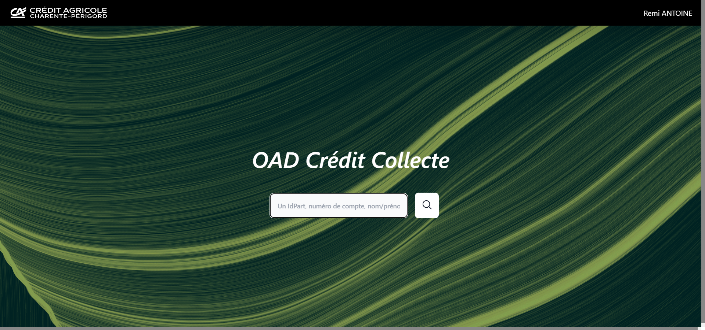
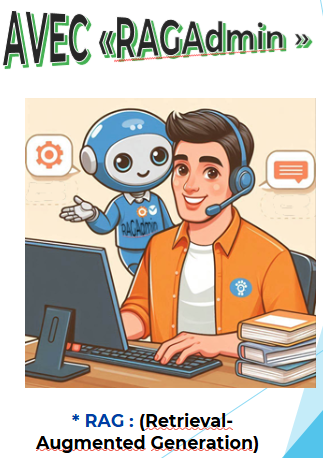

# Portfolio

Salut :smile:

Bienvenue sur mon portfolio ! Je m'appelle Rémi et je suis un étudiant en 3ème année de [BUT Informatique](https://www.iut.unilim.fr/les-formations/but/informatique/) Je suis sérieux. Je suis doué de réelles compétences en développement et en mathématiques, désireux de contribuer à votre entreprise en apportant mon expérience en informatique.

## Mes coordonnées

Profil : 

## Parcours

- STAGE CREDIT AGRICOLE | Avril 2024 / Juin 2024

Développement d'une application d'aide à la décision pour le service marketing avec le framework Laravel et VueJS.

- BUT INFORMATIQUE | 2022/2025

Le BUT informatique forme à la conception, la réalisation et la 
mise en œuvre de solutions informatiques répondant aux besoins 
de transformation numérique des entreprises. La formation 
transmet des savoirs fondamentaux en développement 
informatique et Web, dans les langages de programmation les 
plus utilisés, dans l’administration des systèmes et réseaux, dans 
les bases de données et en conduite de projets. 

- BAC GENERAL | 2021/2022

Bac spécialités mathématiques expertes/Numérique et sciences 
informatiques obtenu avec une mention

## Compétences personnelles

### Hard Skills
| **Catégorie**                     | **Technologies**                                                                                                                                                                                                                                                                                                                                                      |
|-----------------------------------|----------------------------------------------------------------------------------------------------------------------------------------------------------------------------------------------------------------------------------------------------------------------------------------------------------------------------------------------------------------------|
| **Développement**                 |       |
| **Développement mobile**          |                                                                                                                                                                                                                                                                 |
| **Développement web**             |       |
| **Gestion de bases de données**   |                                                                                                                                                                                                                                                                         |
| **Autres compétences**            |                                                                                                             |

### Soft skills
| **Langues**                     | **Français parlé couramment, anglais niveau professionnel C1**                                                                                                                                                                                                                                                                                                                                                      |
|-----------------------------------|----------------------------------------------------------------------------------------------------------------------------------------------------------------------------------------------------------------------------------------------------------------------------------------------------------------------------------------------------------------------|

## Projets réalisés

- RAGAdmin

  

    

      Le projet consiste à réaliser un RAG pour l'entreprise française LaPoste. En équipe, nous avons créé une application web autour d'un LLM.  
      Les besoins du client étaient :
      <ul>
        <li>Apprendre au modèle de langage une technologie.</li>
        <li>Accompagner un expert informatique dans la montée en compétence sur une technologie.</li>
        <li>Exécuter des actions de résolution des incidents de niveau 1 en autonomie.</li>
        <li>Proposer des actions de résolution d'incidents sur le MCO de niveau 2.</li>
      </ul>
    

  

  

    
  

- LANCER DE RAYONS SUR C++

En équipe, nous avons analysé et compléter le code d’une 
autre équipe pour une solution de lancer de rayons. J’ai créé 
des structures pour générer des objets, des sources de 
lumière et comparer le résultat de nos tests au cahier des 
charges.

- MISE EN PLACE D’UN RÉSEAU FICTIF SÉCURISE

En équipe, nous avons analysé les besoins d’une entreprise et
imaginé une solution pour ce besoin. Une fois le réseau 
virtuel créé, j’ai écrit les commandes pour mettre en place un 
filtrage sur ce réseau.

- JEU DU VERGER EN JAVA

J’ai analysé et codé un besoin pour créer une version en 
programmation orientée objets du Jeu du Verger dans lequel 
les enfants font la course contre un corbeau. Le résultat est 
fonctionnel pour 4 joueurs et j’ai obtenu des retours positifs 
de la part des commanditaires du projet.

## Langues 
- ANGLAIS :
Excellent en compréhension orale/écrite

## Hobbies ✏️ 🏹
- Pratique du tir à l’arc :
démontre ma discipline, ma persévérance 
et ma capacité à créer du lien dans une association.
- Écriture, dessin :
nécessite de faire preuve de patience et de 
pensée analytique.

## Mon github

